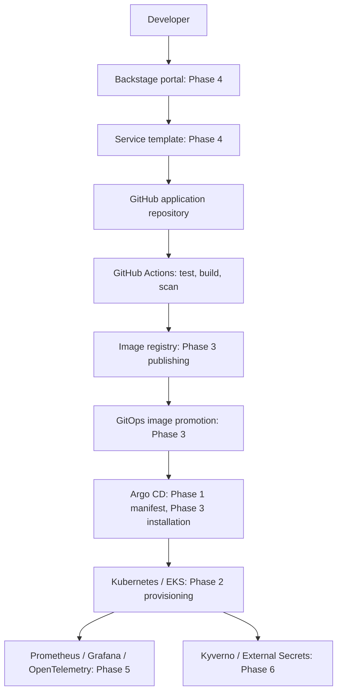

# Platform Engineering IDP

A portfolio Internal Developer Platform that will let application developers
create and deploy services through Backstage without maintaining infrastructure,
Kubernetes manifests or delivery pipelines themselves.

**Current scope: Phase 1 foundation.** The API and deployment definitions are
implemented. Backstage, automated delivery, and the shared platform components
will be built incrementally across [eight phases](docs/roadmap.md).
This is a production-oriented development foundation, not a production deployment.



## Repository layout

```text
platform-engineering-idp/
├── apps/
│   └── sample-service/           # API, native tests, Dockerfile
├── infrastructure/
│   └── terraform/
│       ├── environments/dev/    # Provider, inputs, module composition, state examples
│       └── modules/
│           ├── network/         # VPC, subnets, routing and NAT
│           └── eks/             # Cluster, IAM access, logs and managed workers
├── platform/
│   ├── helm/sample-service/     # Deployment and ClusterIP Service
│   ├── argocd/                  # Scoped AppProject and Application
│   └── kubernetes/              # Bootstrap namespace
├── .github/
│   ├── workflows/ci.yaml
│   └── dependabot.yml
├── docs/                       # Plan, roadmap and validation evidence
└── README.md
```

Application source, cloud resources and platform configuration have separate
ownership boundaries. A monorepo makes Phase 1 easy to inspect and clone. Phase 3
will separate the GitOps repository; Phase 4 templates will create service repos.
GitHub requires workflows in the root `.github/workflows` directory.

## Run and test the API

Use Node.js 24 LTS for parity with CI and the container. The source also supports
Node.js 22. Run these commands from the repository root:

```powershell
cd apps/sample-service
npm ci --ignore-scripts
npm run check
npm test
npm start
```

In another terminal:

```powershell
curl.exe http://localhost:8080/
curl.exe http://localhost:8080/healthz
curl.exe http://localhost:8080/readyz
```

| Endpoint | Purpose |
| --- | --- |
| `GET /` | Service identity, version and greeting |
| `GET /healthz` | Process liveness, returns 200 |
| `GET /readyz` | Traffic readiness, returns 200; becomes 503 when draining |

HEAD is supported, unknown routes return 404, and other methods return 405.
`PORT` defaults to 8080; `APP_VERSION` defaults to 0.1.0. The service is stateless,
has no database, authentication or public ingress, and writes JSON logs to stdout.
It excludes query strings, bodies and headers from logs. Avoid secrets in URL paths.

**Why native Node.js:** no runtime packages are needed for three small routes.
The built-in test runner exercises real HTTP responses without introducing a
framework. The lockfile establishes the dependency workflow for future packages.
App construction is separate from process startup so tests can use ephemeral ports.
SIGTERM marks the service unready, stops accepting connections and allows requests
up to 10 seconds to finish within Kubernetes' 30-second termination grace period.
HTTP timeouts bound slow clients. Database readiness checks can be added later
without making liveness depend on external systems.

## Build and run the container

With Docker Desktop running Linux containers, from the repository root:

```powershell
docker build --pull -t sample-service:0.1.0 apps/sample-service
docker run --rm --name sample-service --read-only --cap-drop=ALL --security-opt=no-new-privileges --memory=128m --cpus=0.5 -p 127.0.0.1:8080:8080 sample-service:0.1.0
```

The Debian slim Node.js LTS image balances compatibility and size. The build copies
only the package metadata and source; a builder stage is unnecessary without
compilation or dependencies. The process uses the image's `node` user (UID 1000),
exec-form startup and an unprivileged port. The Docker health check is useful
outside Kubernetes; Kubernetes uses its own probes. No writable filesystem is needed.
The base tag receives security patches via `--pull`; this means builds are not yet
bit-for-bit reproducible. Phase 3 will pin and regularly refresh the base digest
and promote application image digests. Dependabot proposes dependency updates.

## Inspect or deploy the Helm chart

```powershell
helm lint --strict platform/helm/sample-service
helm template sample platform/helm/sample-service --namespace idp-dev
```

For an existing **development** cluster, first make the image available to its
container runtime: load the local image using your cluster tool, or push it to a
reachable registry and override `image.repository` and `image.tag`.

```powershell
kubectl apply -f platform/kubernetes/namespace.yaml
helm upgrade --install sample platform/helm/sample-service --namespace idp-dev --wait --timeout 180s
kubectl rollout status deployment/sample-sample-service -n idp-dev
kubectl port-forward -n idp-dev svc/sample-sample-service 8080:80
```

The default image is local `sample-service:0.1.0`; no image has been published.
For a registry deployment, append `--set image.repository=REGISTRY/sample-service
--set-string image.tag=COMMIT_SHA` to the Helm command. For a private registry,
configure access with `imagePullSecrets` using a pre-existing secret, or ECR node
identity once Phase 2 is configured. Never put registry credentials in values files.

**Why Helm:** one reusable chart is the future service template's deployment
contract. Values expose images, replicas, resources, Service port and pull secrets.
Two replicas and a zero-unavailable rolling update improve continuity; a soft node
spread preference also permits small local clusters. The defaults reserve 100m CPU
and 64Mi RAM per pod, capped at 500m/128Mi; these are starting budgets to tune with
measurements. Startup probes protect boot, readiness controls traffic, and liveness
detects an unhealthy process. Pods are non-root, use a read-only filesystem, drop
all capabilities, apply RuntimeDefault seccomp, and do not mount API credentials.
The bootstrap namespace enforces Kubernetes' restricted Pod Security profile pinned
to v1.35, matching EKS. For older local clusters, set that label to their version.

A ClusterIP Service keeps this unauthenticated sample internal. TLS, ingress,
network policy, disruption budgets and autoscaling arrive once their controllers
and operational requirements are established. Replica count alone is not an SLA.
Generated Kubernetes resource names include both release and chart names to allow
multiple installations; the `sample` release creates `sample-sample-service`.

## Terraform foundation

Terraform 1.10+ is required for the future S3 native locking setup; CI uses 1.14.5.
The AWS provider is constrained to major version 6 and the committed lockfile pins
the resolved release. Initial validation needs network access to download it,
but no AWS account or credentials:

```powershell
terraform fmt -check -recursive infrastructure/terraform
terraform -chdir=infrastructure/terraform/environments/dev init -backend=false -input=false -lockfile=readonly
terraform -chdir=infrastructure/terraform/environments/dev validate
```

The root composes two local modules, keeping cloud concerns out of the application
chart. Explicit resources make the learning project inspectable without another
module abstraction. Networking provides a dedicated /16 VPC, two public and two
private /24 subnets across two AZs, an internet gateway and one NAT gateway.
Workers receive no public IPs. Subnet tags prepare for later load balancer discovery.
**One NAT gateway is a development cost tradeoff:** it creates an AZ dependency and
can incur cross-AZ transfer charges; production needs per-AZ NAT or an evaluated
private endpoint design. VPC flow logs and endpoint restrictions are later hardening.

EKS defaults to Kubernetes 1.35, a private API endpoint and two on-demand
`t3.medium` AL2023 workers, with group bounds of two to three. No autoscaler is
installed, so the maximum does not trigger automatic scaling. The managed node
group simplifies patching; its launch template encrypts gp3 root disks and requires
IMDSv2 with hop limit 1. All control-plane log types have 30-day retention.
The cluster uses API-based access entries with no implicit creator administrator;
an explicit existing IAM role receives administrator access. Narrow developer RBAC
comes later. CNI permissions initially use the node role; Phase 6 will move them to
dedicated workload identity. EKS bootstrap networking/DNS components are used for
the foundation; explicitly versioned managed add-ons are Phase 2 work.

Before Phase 2 provisioning:

1. Create an AWS account/role setup and review costs and region/AZ availability.
2. Create an encrypted, versioned, public-access-blocked S3 state bucket with scoped
   IAM access. Copy `backend.tf.example` to `backend.tf` and `backend.hcl.example`
   to `backend.hcl`, replace the bucket, and initialize using
   `terraform init -backend-config=backend.hcl` from `environments/dev`.
   If local state already exists, use `-migrate-state` and verify migration.
3. Copy `terraform.tfvars.example` to `terraform.tfvars`; replace the administrator
   ARN. Choose private operator connectivity (VPN/VPC runner) or allow only your
   trusted public IPv4 `/32` through `public_access_cidrs`. The public API rejects
   `/0` in input validation. AWS CLI credentials must be supplied outside the repo.
4. Review a saved Terraform plan before applying it. Check EKS version support and
   instance capacity in your region, and confirm access using the configured role.

Backend examples are inactive so Phase 1 can validate without AWS. Do not use the
default local state for a shared environment. State, tfvars, plans and backend
configuration are ignored because they can hold sensitive values; lockfiles are
committed. There is no Terraform apply workflow in this phase. Provisioning will
incur EKS, EC2, NAT, public IPv4, storage and logging charges until cleaned up.

## Continuous integration

Pull requests, pushes to `main`, and manual dispatch run three jobs:

1. **Test:** locked install, syntax checks, HTTP tests and `npm audit` for high or
   critical dependency findings. There are currently no application dependencies.
2. **Configuration:** strict Helm lint, chart rendering, Terraform formatting,
   provider initialization with the lockfile, and Terraform validation without AWS.
3. **Container:** after both pass, build a commit-tagged image, test it with the same
   read-only/capability/resource restrictions, verify graceful shutdown, then scan
   image packages with Anchore/Grype. High and critical vulnerabilities fail the job.

Actions are pinned to full commit IDs, tokens have read-only repository permissions,
checkout does not retain credentials, and jobs have timeouts. The workflow uses
ordinary PR events, requires no cloud secrets, and does not publish images or deploy.
Configure `test`, `configuration`, and `container` as required branch-protection
checks after creating the GitHub repository. Image scans depend on the vulnerability
database and may reveal new findings without source changes; refresh the base image
or review a narrowly justified exception instead of disabling the gate. These are
basic dependency/image checks, not a full security audit or IaC policy evaluation.

## Argo CD handoff

The Application tracks `main`, renders the service chart with `values-dev.yaml`,
and targets only `idp-dev`. A dedicated AppProject permits this source repository
and only namespaced Deployments and Services. Namespace creation is bootstrapped
separately to keep cluster-level privileges out of application delivery.

Before using the manifests, install Argo CD in Phase 3, push this project to GitHub,
replace `OWNER` in both Argo CD manifests, and replace the image repository and
`COMMIT_SHA` in `values-dev.yaml` with a published image. Use lowercase GHCR names,
or replace that illustrative URL with ECR. Configure Argo CD repository access if
the repository is private and image pull access if the image is private.

```powershell
kubectl apply -f platform/kubernetes/namespace.yaml
kubectl apply -f platform/argocd/project.yaml
kubectl apply -f platform/argocd/sample-service.yaml
# With the Argo CD CLI installed and authenticated:
argocd app sync sample-service-dev
argocd app wait sample-service-dev --health --timeout 180
```

Sync is manual and automated pruning is absent while bootstrap is under development.
Phase 3 introduces the separate GitOps repository, image publishing/promotion and
automated reconciliation. Do not manage the same release with both manual Helm and
Argo CD once that transition is complete. The current placeholders are intentionally
non-deployable until a real repository and published image exist.

## Validation and next work

See [local verification](docs/validation.md), the [original implementation plan](docs/phase-1-plan.md)
and [phase acceptance criteria](docs/roadmap.md). Cloud apply, live cluster rollout,
Argo CD reconciliation and a hosted CI run need their respective environments.

The next milestone is Phase 2: establish AWS access and remote state, review a costed
plan, then provision and verify EKS. Backstage, Prometheus, Grafana, OpenTelemetry,
External Secrets and Kyverno are intentionally roadmap items, not empty services.

## References

- [Node.js release schedule](https://github.com/nodejs/Release): runtime lifecycle.
- [AWS EKS version lifecycle](https://docs.aws.amazon.com/eks/latest/userguide/kubernetes-versions.html): verify the selected Kubernetes version before provisioning.
- [Terraform AWS provider](https://registry.terraform.io/providers/hashicorp/aws/latest/docs): resource configuration.
- [Terraform S3 backend](https://developer.hashicorp.com/terraform/language/backend/s3): state storage and native locking.
- [Argo CD Application specification](https://argo-cd.readthedocs.io/en/stable/user-guide/application-specification/): Git source, Helm values and sync behavior.
- [Anchore scan action](https://github.com/anchore/scan-action): image scan inputs and severity gate.
