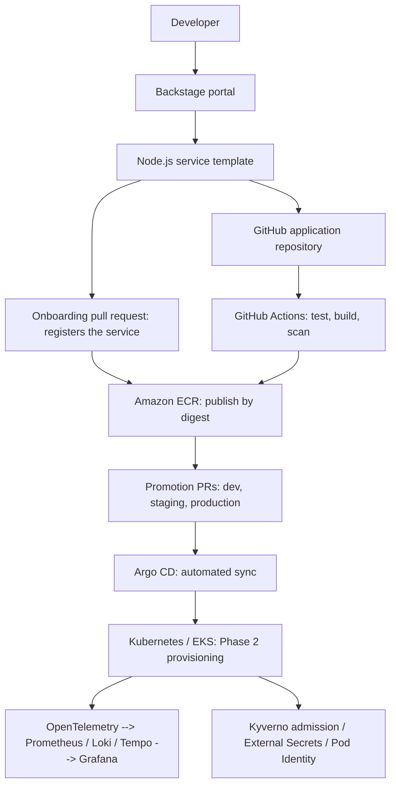

# Platform Engineering IDP

A portfolio Internal Developer Platform that will let application developers
create and deploy services through Backstage without maintaining infrastructure, Kubernetes manifests or delivery pipelines themselves.

**All [eight phases](docs/roadmap.md) are built.** Creating a service is a form;
delivery is closed; deployments are observable, constrained and promoted through
staging to production; and a bad release is recovered by a procedure tested on every
CI run. **None of it has been applied to AWS**, though the service, its secret handling, a
failed-release rollback and the admission policies have passed on a real Kubernetes API
server in kind — the roadmap's
status table says exactly what has been verified, and how.

| Start here | For |
| --- | --- |
| [Demonstration](docs/demo.md) | Seeing it work: locally with no AWS, or the full cloud walkthrough |
| [Operations](docs/operations.md) | What it costs, what it does not do, and how to take it down |
| [Decision records](docs/adr/README.md) | Why it is built this way, and what each choice costs |
| [Validation](docs/validation.md) | Every claim, how it was checked, and what was not |
This is a production-oriented development foundation, not a production deployment.



## Repository layout

```text
platform-engineering-idp/
├── apps/
│   └── sample-service/           # API, native tests, Dockerfile
├── infrastructure/
│   └── terraform/
│       ├── environments/
│       │   ├── bootstrap/       # State bucket, GitHub OIDC provider, Terraform roles
│       │   └── dev/             # Provider, inputs, module composition, backend
│       └── modules/
│           ├── network/         # VPC, subnets, routing and NAT
│           ├── eks/             # Cluster, IAM access, logs, add-ons, managed workers
│           └── ecr/             # Per-service image repositories and retention
├── platform/
│   ├── backstage/
│   │   ├── app-config.yaml     # Portal configuration; the app itself is generated
│   │   ├── catalog/            # Groups, domain, system and infrastructure resources
│   │   └── templates/          # Service template, its skeleton and onboarding change
│   ├── helm/service/            # Shared chart: Deployment and ClusterIP Service
│   ├── argocd/
│   │   ├── install/            # Pinned Argo CD installation
│   │   ├── applications/       # App-of-apps root, services and platform components
│   │   └── projects/           # Scoped AppProjects: idp and platform
│   ├── observability/
│   │   ├── values/             # Pinned upstream chart configuration
│   │   └── manifests/          # Collectors, instrumentation, alerts, dashboards
│   ├── cluster/values/         # Cluster prerequisites: metrics-server
│   ├── security/
│   │   ├── policies/           # Kyverno admission policies for idp-dev
│   │   ├── tests/              # Policy tests and deliberate violations
│   │   └── values/             # Kyverno and External Secrets configuration
│   ├── scripts/                # Promotion, platform checks, policy tests
│   └── kubernetes/              # Bootstrap namespace
├── gitops/
│   └── environments/           # Deployed digests for dev, staging and production
├── .github/
│   ├── workflows/ci.yaml       # Tests, checks, build/scan, publish, promote
│   ├── workflows/terraform.yaml # Plan on pull requests, gated apply on main
│   ├── workflows/promote.yaml  # Environment promotion behind approvals
│   └── dependabot.yml
├── docs/                       # Plans, roadmap, teardown runbook and evidence
└── README.md
```

Each service also carries a `catalog-info.yaml` beside its code, so a catalog
entity moves and dies with the code it describes instead of drifting in a central
list.

Application source, cloud resources, platform configuration and deployment state
have separate ownership boundaries, enforced by [`CODEOWNERS`](.github/CODEOWNERS)
rather than by convention. A monorepo keeps the platform inspectable in one clone;
[`gitops/README.md`](gitops/README.md) explains why deployment state is a directory
here rather than a second repository. Services created through the portal get their
own repositories and are not added here. GitHub requires workflows in the root
`.github/workflows` directory.

## Run and test the API

Use Node.js 24 LTS for parity with CI and the container. The source also supports
Node.js 22. Run these commands from the repository root:

```powershell
cd apps/sample-service
npm ci --ignore-scripts
npm run check
npm test
npm start
```

In another terminal:

```powershell
curl.exe http://localhost:8080/
curl.exe http://localhost:8080/healthz
curl.exe http://localhost:8080/readyz
```

| Endpoint | Purpose |
| --- | --- |
| `GET /` | Service identity, version and greeting |
| `GET /healthz` | Process liveness, returns 200 |
| `GET /readyz` | Traffic readiness, returns 200; becomes 503 when draining |

HEAD is supported, unknown routes return 404, and other methods return 405.
`PORT` defaults to 8080; `APP_VERSION` defaults to 0.1.0. The service is stateless,
has no database, authentication or public ingress, and writes JSON logs to stdout.
It excludes query strings, bodies and headers from logs. Avoid secrets in URL paths.

**Why native Node.js:** no runtime packages are needed for three small routes.
The built-in test runner exercises real HTTP responses without introducing a
framework. The lockfile establishes the dependency workflow for future packages.
App construction is separate from process startup so tests can use ephemeral ports.
SIGTERM marks the service unready, stops accepting connections and allows requests
up to 10 seconds to finish within Kubernetes' 30-second termination grace period.
HTTP timeouts bound slow clients. Database readiness checks can be added later
without making liveness depend on external systems.

## Build and run the container

With Docker Desktop running Linux containers, from the repository root:

```powershell
docker build --pull -t sample-service:0.1.0 apps/sample-service
docker run --rm --name sample-service --read-only --cap-drop=ALL --security-opt=no-new-privileges --memory=128m --cpus=0.5 -p 127.0.0.1:8080:8080 sample-service:0.1.0
```

The Debian slim Node.js LTS image balances compatibility and size. The build copies
only the package metadata and source; a builder stage is unnecessary without
compilation or dependencies. The process uses the image's `node` user (UID 1000),
exec-form startup and an unprivileged port. The Docker health check is useful
outside Kubernetes; Kubernetes uses its own probes. No writable filesystem is needed.
The base tag receives security patches via `--pull`; this means builds are repeatable
but not bit-for-bit reproducible. Application images are now promoted by digest, so
what runs is exactly what was scanned; pinning and refreshing the *base* image digest
is still outstanding. Dependabot proposes dependency updates.

## Inspect or deploy the Helm chart

```powershell
helm lint --strict platform/helm/service
helm template sample-service platform/helm/service --namespace idp-dev
```

For an existing **development** cluster, first make the image available to its
container runtime: load the local image using your cluster tool, or push it to a
reachable registry and override `image.repository` and `image.tag`.

```powershell
kubectl apply -f platform/kubernetes/namespace.yaml
helm upgrade --install sample-service platform/helm/service --namespace idp-dev --wait --timeout 180s
kubectl rollout status deployment/sample-service -n idp-dev
kubectl port-forward -n idp-dev svc/sample-service 8080:80
```

The chart default is the local `sample-service:0.1.0`. `values-dev.yaml` now carries
environment shape only; the image identity lives in
[`gitops/environments/dev/sample-service.yaml`](gitops/environments/dev/sample-service.yaml)
and reaches the chart through `image.digest`, which takes precedence over
`image.tag`. To deploy a specific image by hand, append `--set
image.repository=REGISTRY/sample-service --set image.digest=sha256:...`. For a
private registry, configure access with `imagePullSecrets` using a pre-existing
secret; ECR in this account needs none, because the node role can pull. Never put
registry credentials in values files.

**Why Helm:** one reusable chart is the future service template's deployment
contract. Values expose images, replicas, resources, Service port and pull secrets.
Two replicas and a zero-unavailable rolling update improve continuity; a soft node
spread preference also permits small local clusters. The defaults reserve 100m CPU
and 64Mi RAM per pod, capped at 500m/128Mi; these are starting budgets to tune with
measurements. Startup probes protect boot, readiness controls traffic, and liveness
detects an unhealthy process. Pods are non-root, use a read-only filesystem, drop
all capabilities, apply RuntimeDefault seccomp, and do not mount API credentials.
The bootstrap namespace enforces Kubernetes' restricted Pod Security profile pinned
to v1.35, matching EKS. For older local clusters, set that label to their version.

A ClusterIP Service keeps this unauthenticated sample internal. TLS, ingress,
network policy, disruption budgets and autoscaling arrive once their controllers
and operational requirements are established. Replica count alone is not an SLA.
One chart, named `service`, is shared by every service on the platform, so
resource names come from the release rather than the chart: the `sample-service`
release creates a Deployment and Service both named `sample-service`. That name is
also the catalog entity, the ECR repository and the Kubernetes label the portal
selects on, which is what lets one identifier follow a service end to end.

## Terraform foundation

Terraform 1.10+ is required for the future S3 native locking setup; CI uses 1.14.5.
The AWS provider is constrained to major version 6 and the committed lockfile pins
the resolved release. Initial validation needs network access to download it,
but no AWS account or credentials:

```powershell
terraform fmt -check -recursive infrastructure/terraform
terraform -chdir=infrastructure/terraform/environments/dev init -backend=false -input=false -lockfile=readonly
terraform -chdir=infrastructure/terraform/environments/dev validate
```

The root composes two local modules, keeping cloud concerns out of the application
chart. Explicit resources make the learning project inspectable without another
module abstraction. Networking provides a dedicated /16 VPC, two public and two
private /24 subnets across two AZs, an internet gateway and one NAT gateway.
Workers receive no public IPs. Subnet tags prepare for later load balancer discovery.
**One NAT gateway is a development cost tradeoff:** it creates an AZ dependency and
can incur cross-AZ transfer charges; production needs per-AZ NAT or an evaluated
private endpoint design. VPC flow logs and endpoint restrictions are later hardening.

EKS defaults to Kubernetes 1.35, a private API endpoint and two `t3.medium`
AL2023 workers, with group bounds of two to four. No autoscaler is installed, so
the maximum is a bound rather than a scaling trigger. The managed node group
simplifies patching; its launch template encrypts gp3 root disks and requires
IMDSv2 with hop limit 1. All control-plane log types have 30-day retention.
The cluster uses API-based access entries with no implicit creator administrator;
an explicit existing IAM role receives administrator access. Narrow developer RBAC
comes later.

**Workers default to spot capacity.** Spot is roughly 70% cheaper, which is what
makes an always-available portfolio cluster affordable, and the tradeoff is that a
node can be reclaimed at two minutes notice. Two comparable instance types are
listed so the request draws from a wider capacity pool, and `max_size` leaves
headroom for replacements. Set `capacity_type = "ON_DEMAND"` before a live demo if
a reclaimed node would be disruptive.

Networking and DNS run as **explicitly versioned managed add-ons** rather than the
unversioned components EKS installs at bootstrap: `vpc-cni`, `kube-proxy`,
`eks-pod-identity-agent`, `coredns` and `aws-ebs-csi-driver`. Putting the version in
state turns an upgrade into a reviewable plan change instead of silent drift.
Versions resolve at plan time from `aws_eks_addon_version` rather than being
hardcoded, because a pinned version may not exist in every region or Kubernetes
release. Ordering is explicit: CNI and kube-proxy attach to the control plane, while
CoreDNS and the CSI driver are scheduled workloads that wait for the node group.

The EBS CSI controller gets its permissions through **EKS Pod Identity**, not the
node role, so a compromised workload cannot manage cluster storage. Pod Identity is
preferred over IRSA here because it needs no OIDC provider, no certificate
thumbprint and no trust policy rewrite when the cluster is replaced. Phase 6 extends
the same mechanism to application workloads. CNI permissions still use the node
role.

## Remote state and CI identity

`environments/bootstrap` is applied once, by an administrator, before anything else.
It creates the state bucket and the identities CI uses, so it is the only root that
cannot itself run through CI.

The **state bucket** is versioned, encrypted, public-access-blocked and rejects
plaintext HTTP through a bucket policy, because S3 permits it by default. Locking
uses S3 native `use_lockfile` rather than a DynamoDB table, which removes a resource
and its cost from the design; this is why Terraform 1.10+ is required. The bucket
carries `prevent_destroy`: state is not reproducible from the repository, so losing
it is worse than losing the infrastructure it describes. Old versions expire after
90 days, retaining ten, so recovery stays possible without unbounded storage.

Bootstrap keeps **local state** deliberately. Storing its state in the bucket it
creates would be circular, and it describes only a bucket and two roles.

CI authenticates with **GitHub OIDC**, so there are no AWS access keys in GitHub to
leak or rotate. Two roles separate reading from writing:

- `idp-terraform-plan` — `ReadOnlyAccess`, assumable from pull requests and `main`.
  It also gets write access to the state prefix, because S3 native locking writes a
  lock object beside the state and a strictly read-only role cannot plan.
- `idp-terraform-apply` — assumable **only** from the `aws-dev` GitHub Environment.
  The human approval gate lives on that environment, and the trust policy enforces
  it, so a workflow that skips the gate cannot obtain write credentials at all.

The apply role uses `PowerUserAccess`, which covers VPC, EKS, EC2, ECR and S3 while
excluding IAM, so its blast radius stops short of the account's own permission
model. EKS still needs to create roles, so that is granted back narrowly: only for
role names under the `idp-` prefix, plus the specific service-linked roles EKS,
node groups and spot require. The subject claim is matched against this exact
repository rather than a wildcard, since that claim is the only thing separating
these roles from any other repository on GitHub.

## Image registry

`modules/ecr` creates one repository per service. **Tags are immutable**, so a
deployed digest can never be silently replaced — that is what makes the image
reference recorded in Git trustworthy now that Argo CD drives deployments.
Scan-on-push gives a registry-side vulnerability view independent of the
CI-side Grype gate. A lifecycle policy expires untagged layers after seven days and
keeps twenty tagged images, bounding storage cost while leaving rollback targets.
`force_delete` is off, so destroying a repository that still holds images requires a
conscious decision rather than silently deleting published artefacts.

The repositories that exist are **derived from `gitops/environments/dev`** rather
than listed in a variable: a service exists on this platform exactly when it has
deployment state. The bootstrap root reads the same directory to decide which
GitHub repositories may publish images, which is what lets the portal onboard a
service with one reviewed pull request instead of three edits a scaffolder cannot
make. The consequence is that merging a file there creates AWS resources and grants
publish rights, so `gitops/**` is owned in `CODEOWNERS` and reviewed as
infrastructure.

The registry is a separate module from the cluster because images outlive any single
cluster; the environment can be destroyed and rebuilt without republishing.

## Provisioning

Follow the [Phase 2 runbook](docs/phase-2-plan.md) for the full sequence. In short:
apply `environments/bootstrap`, record its outputs as GitHub secrets, create the
`aws-dev` environment with a required reviewer, then initialise `environments/dev`
with `terraform init -backend-config=backend.hcl`.

Before applying, choose private operator connectivity (VPN or a VPC runner) or allow
only your trusted public IPv4 `/32` through `public_access_cidrs`; the input
validation rejects `/0`. State, tfvars, plans and backend configuration are
gitignored because they can hold account-specific or sensitive values; lockfiles are
committed.

**This environment bills by the hour whether or not anything is deployed to it** —
roughly $132/month on spot, $181/month on-demand, before usage-based charges. The
[teardown runbook](docs/teardown.md) has an itemised breakdown and an ordered destroy
procedure. Destroy order matters: load balancers and volumes created by Kubernetes
are invisible to Terraform, and a stranded load balancer keeps billing and blocks
VPC deletion.

## Continuous integration

Pull requests, pushes to `main`, and manual dispatch run three jobs:

1. **Test:** locked install, syntax checks, HTTP tests and `npm audit` for high or
   critical dependency findings. There are currently no application dependencies.
2. **Configuration:** strict Helm lint, chart rendering, Terraform formatting,
   provider initialization with the lockfile, and Terraform validation without AWS.
3. **Container:** after both pass, build a commit-tagged image, test it with the same
   read-only/capability/resource restrictions, verify graceful shutdown, then scan
   image packages with Anchore/Grype. High and critical vulnerabilities fail the job.
   On `main` only, the job then assumes the publish role, pushes that same image to
   ECR and records its digest. Re-running a build for an already published commit
   reuses the published digest rather than failing against the immutable tag.
4. **Promote:** rewrites `gitops/environments/dev/sample-service.yaml` with the new
   digest and opens a pull request containing that single change. It is the only job
   that keeps checkout credentials, and the only one that can write to the repository.

The configuration job also asserts that a set digest reaches the rendered container
image reference, exercises the promotion script's digest validation, and runs
`platform/scripts/check-platform.py`. A promotion mechanism that silently rendered a
tag would look identical in review; so would a template whose skeleton ships its
placeholders unrendered, or a service registered with no Argo CD Application to
deploy it.

A second workflow, `terraform.yaml`, handles infrastructure. Pull requests touching
`infrastructure/terraform/**` get a plan posted as a comment; merging to `main` runs
the apply job, which pauses on the `aws-dev` environment until a reviewer approves.

Plan and apply are separate jobs with separate AWS roles, so a pull request from a
fork or an untrusted branch can never hold write credentials. The apply job plans
and applies in the same step rather than passing a saved plan between jobs: the plan
being applied is the one just computed against current state, and no plan file — which
can contain resource values — is uploaded as an artifact. Concurrency is serialised
rather than cancelled, because cancelling mid-apply leaves a held state lock.

Actions are pinned to full commit IDs, tokens have read-only repository permissions
by default, checkout does not retain credentials, and jobs have timeouts. `id-token:
write` is granted only in the jobs that authenticate to AWS, and the publish steps
are additionally gated on the event being a push to `main`, so a pull request — from
a fork or otherwise — builds and scans the image but can never publish it.
Configure `test`, `configuration`, and `container` as required branch-protection
checks after creating the GitHub repository. Image scans depend on the vulnerability
database and may reveal new findings without source changes; refresh the base image
or review a narrowly justified exception instead of disabling the gate. These are
basic dependency/image checks, not a full security audit or IaC policy evaluation.

## GitOps delivery

Argo CD reconciles `main` into the cluster. The [Phase 3 runbook](docs/phase-3-plan.md)
has the installation and delivery procedure; this is what it is made of.

**Installation** is a pinned upstream release, not `stable`, so no unrelated apply
can move the control plane to a new minor version:

```powershell
kubectl kustomize platform/argocd/install | kubectl apply -f -
kubectl apply -f platform/kubernetes/namespace.yaml
kubectl apply -f platform/argocd/projects/
kubectl apply -f platform/argocd/applications/root.yaml
```

**An app-of-apps** watches `platform/argocd/applications`, so adding a service is a
commit rather than a `kubectl apply`. It excludes its own definition: a root
Application that manages itself can prune the controller's entry point during a bad
sync. The AppProject and root are therefore applied once by hand.

**The service Application has two sources.** The chart supplies how the workload runs;
`gitops/environments/dev/sample-service.yaml`, referenced through Argo CD's `$values`
alias, supplies which image runs. That split is the point: CI's promotion job writes
deployment state and cannot touch the probes, resource limits or security context it
is deploying under.

**Sync is automated with self-heal and prune,** which is what makes Git the source of
truth rather than a record of intent — a revert is a deployment, with no operator
action in between. Scaling the Deployment by hand is reverted by the controller. Do
not manage the same release with both manual Helm and Argo CD.

Before using the manifests, push this project to GitHub and replace `OWNER` in
`platform/argocd/projects/` and in the files under `platform/argocd/applications/`; the AppProject
restricts sources to that exact repository URL. Configure Argo CD repository access if
the repository is private. Until the first promotion, deployment state names
`PENDING_FIRST_PROMOTION` and is intentionally non-deployable.

The Argo CD server is not exposed; reach it with `kubectl -n argocd port-forward
svc/argocd-server 8080:443`. That avoids paying for a load balancer and avoids
publishing an admin interface during development.

## Developer self-service

A developer creates a service by filling in a form, not by copying a repository
and editing five files. The [Phase 4 runbook](docs/phase-4-plan.md) has the full
procedure; [`platform/backstage/README.md`](platform/backstage/README.md) covers
running the portal.

**The form collects five things** — name, description, owner, system and lifecycle.
Everything else is derived from the name, because the repository, the catalog
entity, the Kubernetes release, the ECR repository and the OIDC trust subject are
all the same identifier. Letting them differ would mean five names for one service.

**Ownership is a group, never a person.** The owner picker offers Groups only: a
service owned by an individual becomes unowned the day they change team.

**The template produces two things.** A repository containing the service, its
tests, a hardened container build and the same pipeline this repository runs; and
a pull request against this repository containing exactly two files — deployment
state and an Argo CD Application.

**That pull request is reviewed rather than pushed.** Merging it is what creates
the service's ECR repository *and* grants its GitHub repository permission to
publish images, both derived from the deployment state file. The scaffolder holds
a token that could push directly; it opens a pull request instead, because a
portal that can grant itself AWS access has moved the trust boundary.

**The skeleton is checked, not just stored.** `platform/scripts/check-platform.py`
runs in CI and fails on a catalog entity owned by a non-existent group, a template
that passes a value it never declares, a skeleton file that would ship its
placeholders unrendered, YAML that stops being YAML once rendered, and a registered
service with no Application to deploy it.

What is not built: the portal is not hosted in the cluster, identity is a
placeholder rather than GitHub organisation ingestion, and the permission framework
is off. Each is deliberate and explained in the runbook.

## Observability

A request through a service produces a trace, its metrics and logs are findable
from the service's name, and a failure raises an alert that links to what to do
about it. The [Phase 5 runbook](docs/phase-5-plan.md) has the procedure and the
alert response table.

**Services are instrumented by the platform, not by themselves.** The
OpenTelemetry Operator injects the SDK at admission, triggered by an annotation
the shared chart adds. The sample service and every scaffolded service still have
zero dependencies, cannot drift onto an old SDK, and cannot forget to instrument.
The cost is stated plainly: auto-instrumentation covers inbound and outbound HTTP
and nothing else, and the SDK version is now the platform's problem.

**One endpoint, three signals.** Services send OTLP to a gateway collector; a
daemonset collector reads container logs off each node. Traces go to Tempo, logs
to Loki, metrics to Prometheus by remote write. Where data actually lands is a
platform decision that can change without touching a service.

**`OTEL_SERVICE_NAME` is the same string as everything else.** The chart sets it
from the release name, which is also the catalog entity, the Argo CD Application,
the ECR repository and the Kubernetes label. One identifier follows a service from
the portal to a span.

**Dashboards and alerts are files.** A dashboard built by clicking exists only in
that Grafana and cannot be explained in a pull request. Every alert carries a
`runbook_url`, and CI fails if one does not — an alert that fires without saying
what to do is a notification.

**The pipeline watches itself.** `TelemetryExportFailing` and
`TelemetryCollectorRefusingData` exist because monitoring that fails silently
leaves the dashboards green and wrong.

**A second AppProject.** Observability charts need CRDs, cluster roles and
admission webhooks. `platform` may create those; `idp`, which deploys application
code, still cannot create a single cluster-scoped object.

Nothing is durable: Prometheus, Loki and Tempo write to `emptyDir` with 24-hour
retention, which is right for a cluster torn down between sessions and wrong for
anything else. Alertmanager has no receiver configured on purpose — a route to an
unread inbox looks like coverage.

## Security and secrets

A service can read its own secrets and nothing else, rotations reach it without a
redeploy, and a manifest that breaks the platform's conventions is refused by the
API server. The [Phase 6 runbook](docs/phase-6-plan.md) has the procedure and the
full access model.

**One IAM role per service, pinned to its service account.** EKS Pod Identity binds
`idp-dev-svc-<service>` to the service's Kubernetes account, and the role's trust
policy requires the namespace and account session tags, so an association to any
other account obtains nothing. The role reads `idp-dev/<service>/*` in Secrets
Manager. Roles, secrets and bindings are derived from `gitops/`, so onboarding is
still one pull request.

**The secrets controller has no secret permission.** External Secrets can only
assume per-service roles, one store at a time, so every read appears in CloudTrail
under the service's own role. Cluster-wide stores are not merely forbidden — their
CRDs are not installed.

**Terraform owns that a secret exists, never its value.** A value in state could be
silently rolled back by a later apply. Values are set and rotated out of band, and
arrive in the pod as read-only files that update in place.

**Admission policy is code with tests.** Six Kyverno `ValidatingPolicy` resources,
in CEL, applied identically to every environment namespace: digest-pinned images from the platform registry, pod
security, resource bounds, a dedicated service account, and two that stop services
sharing a namespace from reaching each other's secrets. `test-policies.sh` renders
the real chart and requires it to pass every policy, including a pod shaped like the
OpenTelemetry Operator's injection, requires 19 violations to fail, and requires platform components in other
namespaces to be skipped. CI refuses a policy that has no namespace selector, never
denies, or has not been shown to pass, fail and skip — and fails any run in which an
expected result was quietly excluded rather than evaluated, which the Kyverno CLI
otherwise grades as a pass.

**Developers read; Git writes.** An optional developer role gets namespace-scoped
view access through an EKS access entry: workloads and logs, no Secrets, no writes.

The largest remaining gap is stated plainly: there are no NetworkPolicies, so pods
in `idp-dev` can reach each other freely. Secrets are isolated between services;
traffic is not.

## Environments and releases

A digest is proven in staging before it may run in production, and a bad release is
recovered by a procedure that runs in CI. The [Phase 7 runbook](docs/phase-7-plan.md)
has the release procedure and the recovery table every SLO alert links to.

**Three environments in one cluster.** `idp-dev`, `idp-staging` and `idp-production`
are namespaces with their own deployment state, chart values, IAM roles and secrets,
all derived from `gitops/environments/<env>`. Separate clusters would roughly triple
the fixed cost; what this does not isolate is a failure of the cluster itself, and the
runbook says so.

**Promotion copies the digest, one step at a time.** `promote-environment.sh` allows
only dev to staging and staging to production, and copies the exact image identity
rather than rebuilding. The `Promote` workflow runs it in a GitHub Environment —
production's requires a reviewer — and opens a pull request, which is the second
approval.

**"Passed staging" is checked from Git history.** CI refuses a production digest that
staging never ran in an earlier commit of its own. A hand edit fails; so does one pull
request that moves staging and production together.

**Services survive disruption by default.** The chart adds a HorizontalPodAutoscaler,
a PodDisruptionBudget and zone spread in staging and production, omits `replicas` so
Argo CD does not fight the autoscaler, and refuses configurations that would hurt —
an autoscaler that can reach one replica, or a budget that would block every node
drain.

**Objectives, not thresholds.** Production targets 99.5% availability and staging 99%,
alerted by multi-window burn rate with a traffic floor. Production pages; staging
opens tickets; dev has no objective. promtool tests prove the alerts fire, stay quiet
on low traffic and in dev, and clear after recovery.

**Recovery is rehearsed.** `rollback-drill.sh` releases twice through every
environment in a throwaway repository, reverts production, and checks the other
environments are untouched — the runbook's primary recovery step, on every CI run.

Building this also exposed that Tempo had never been generating span metrics, which
left every Phase 5 latency and error signal silently inert. The runbook describes that
and the other defect found.

## Validation and next work

See [local verification](docs/validation.md), the [Phase 1 plan](docs/phase-1-plan.md),
the [Phase 2 runbook](docs/phase-2-plan.md), the [Phase 3 runbook](docs/phase-3-plan.md),
the [Phase 4 runbook](docs/phase-4-plan.md), the [Phase 5 runbook](docs/phase-5-plan.md),
the [Phase 6 runbook](docs/phase-6-plan.md), the [Phase 7 runbook](docs/phase-7-plan.md),
the [Phase 8 release notes](docs/phase-8-plan.md),
the [teardown runbook](docs/teardown.md)
and the [phase acceptance criteria](docs/roadmap.md).

Phase 2 through 8 configuration is written and validates locally, but **nothing has
been applied to AWS, no image has been published, the portal has never been started,
no telemetry has ever been collected, and no policy has ever admitted or refused a
real request**. The admission policies, SLO alerts and recovery procedure are the exception to
"untested": 188 policy tests run in CI against the chart rendered for every
environment, 19 violations and out-of-scope components; promtool runs the
burn-rate alerts against synthetic traffic; and a drill releases through every
environment and recovers production. Negative controls show each suite fails when
what it guards is broken. The state bucket, roles,
registry, add-ons and spot node group are unverified against a real account until the
bootstrap and dev roots are applied. Argo CD's installation renders correctly and the
chart renders a promoted digest, but no cluster has reconciled it: rendering is not
admission, and a Synced Application is not a proven rollout. The catalog and template
are checked for internal consistency, which is not the same as Backstage accepting
them. The observability charts render against their pinned versions, which proves
the values are valid and not that the stack runs: a rendered manifest has never met
an admission controller, a scheduler or a node with finite memory. Terraform validation
checks configuration and provider schemas, not permissions, quotas, regional capacity
or successful provisioning.

All eight phases are built, and the end-to-end test has passed on a real Kubernetes API
server. What remains is the cloud track of the [demonstration](docs/demo.md): its first
run is the first time this code meets a real AWS account, and the
[operations guide](docs/operations.md) lists the limitations that would remain even then.

## References

- [Node.js release schedule](https://github.com/nodejs/Release): runtime lifecycle.
- [AWS EKS version lifecycle](https://docs.aws.amazon.com/eks/latest/userguide/kubernetes-versions.html): verify the selected Kubernetes version before provisioning.
- [Terraform AWS provider](https://registry.terraform.io/providers/hashicorp/aws/latest/docs): resource configuration.
- [Terraform S3 backend](https://developer.hashicorp.com/terraform/language/backend/s3): state storage and native locking.
- [Argo CD Application specification](https://argo-cd.readthedocs.io/en/stable/user-guide/application-specification/): Git source, Helm values and sync behavior.
- [Argo CD multiple sources](https://argo-cd.readthedocs.io/en/stable/user-guide/multiple_sources/): the `$values` reference used to layer deployment state over the chart.
- [Argo CD cluster bootstrapping](https://argo-cd.readthedocs.io/en/stable/operator-manual/cluster-bootstrapping/): the app-of-apps pattern.
- [Configuring OpenID Connect in AWS](https://docs.github.com/en/actions/how-tos/secure-your-work/security-harden-deployments/oidc-in-aws): subject claims and trust policy conditions.
- [Anchore scan action](https://github.com/anchore/scan-action): image scan inputs and severity gate.
- [Backstage software templates](https://backstage.io/docs/features/software-templates/): template syntax, parameters and steps.
- [Backstage built-in scaffolder actions](https://backstage.io/docs/features/software-templates/builtin-actions/): `fetch:template`, `publish:github` and `publish:github:pull-request` inputs.
- [Backstage descriptor format](https://backstage.io/docs/features/software-catalog/descriptor-format/): entity kinds, required fields and well-known annotations.
- [OpenTelemetry Operator auto-instrumentation](https://opentelemetry.io/docs/platforms/kubernetes/operator/automatic/): the injection annotation and Instrumentation resource.
- [OpenTelemetry Collector configuration](https://opentelemetry.io/docs/collector/configuration/): receivers, processors, exporters and pipelines.
- [Tempo metrics generator](https://grafana.com/docs/tempo/latest/metrics-generator/): the span metrics these alerts and dashboards are built on.
- [Loki OTLP ingestion](https://grafana.com/docs/loki/latest/send-data/otel/): why structured metadata has to be enabled.
- [EKS Pod Identity role trust](https://docs.aws.amazon.com/eks/latest/userguide/pod-id-role.html): the session-tag conditions each service role requires.
- [EKS Pod Identity session tags](https://docs.aws.amazon.com/eks/latest/userguide/pod-id-abac.html): why tags are transitive and role chaining needs `sts:TagSession`.
- [External Secrets AWS Secrets Manager provider](https://external-secrets.io/latest/provider/aws-secrets-manager/): per-store role assumption.
- [Kyverno ValidatingPolicy](https://kyverno.io/docs/policy-types/validating-policy/): the CEL policy type these are written in.
- [Kyverno CLI test](https://kyverno.io/docs/kyverno-cli/usage/test/): the test manifest format.
- [Alerting on SLOs](https://sre.google/workbook/alerting-on-slos/): the multi-window, multi-burn-rate method.
- [Prometheus unit testing for rules](https://prometheus.io/docs/prometheus/latest/configuration/unit_testing_rules/): the promtool test format.
- [HorizontalPodAutoscaler](https://kubernetes.io/docs/tasks/run-application/horizontal-pod-autoscale/): scaling behaviour and stabilisation windows.
- [Unhealthy pod eviction policy](https://kubernetes.io/docs/tasks/run-application/configure-pdb/#unhealthy-pod-eviction-policy): why a crash-looping pod should not block a drain.
- [Tempo metrics generator processors](https://grafana.com/docs/tempo/latest/metrics-generator/): why processors must be enabled in overrides.
