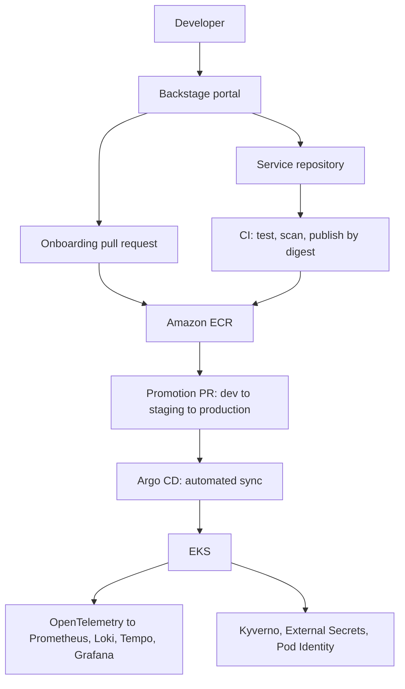

# Platform Engineering IDP

An Internal Developer Platform on AWS EKS. A developer fills in a form in Backstage
and gets a repository, a pipeline, a catalog entry and a deployment. The platform
owns the cluster, the delivery path, observability, policy and the release process.

Built as a portfolio project across [eight phases](docs/roadmap.md), each ending in a
working capability rather than a layer of scaffolding.

## Status

| | |
| --- | --- |
| **Proven on a real Kubernetes API server** | The service runs under restricted Pod Security; a secret rotates into the pod without a restart; a failed release keeps serving and rolls back; admission policy refuses all 19 violation fixtures. Run by `e2e-kind.sh` in CI |
| **Proven offline, in CI** | 188 admission policy tests, SLO alert unit tests, a rollback drill, chart renders against pinned upstream charts, Terraform validation, and a platform consistency check. Every suite has negative controls proving it fails when what it guards breaks |
| **Not proven** | **Nothing has been applied to AWS.** Argo CD, the observability stack, External Secrets and Backstage have been rendered and validated, never started |

[docs/validation.md](docs/validation.md) records every claim, how it was checked, and
what was not. [docs/roadmap.md](docs/roadmap.md) has the same per phase.

## Documentation

| | |
| --- | --- |
| [Demonstration](docs/demo.md) | See it work: locally without AWS, or the full cloud walkthrough |
| [Operations](docs/operations.md) | Costs, limitations and teardown |
| [Decision records](docs/adr/README.md) | Why it is built this way, and what each choice costs |
| [Validation](docs/validation.md) | Evidence for every claim |
| Runbooks | [1](docs/phase-1-plan.md) · [2](docs/phase-2-plan.md) · [3](docs/phase-3-plan.md) · [4](docs/phase-4-plan.md) · [5](docs/phase-5-plan.md) · [6](docs/phase-6-plan.md) · [7](docs/phase-7-plan.md) · [8](docs/phase-8-plan.md) · [teardown](docs/teardown.md) |

## How it works



**One identifier per service.** The name given in the portal becomes the repository,
the catalog entity, the Helm release, the ECR repository, the Kubernetes label, the
IAM role and the OIDC trust subject. One service, one name, end to end.

**Deployment state is data.** `gitops/environments/<env>/<service>.yaml` holds the
image digest that runs. Changing it deploys; reverting it rolls back. Terraform reads
the same directory to decide which services exist, so onboarding is one reviewed pull
request rather than three edits a scaffolder cannot make.

**Images are promoted, never rebuilt.** CI publishes a scanned image by digest.
Promotion copies that digest to the next environment, and CI proves from Git history
that production only runs what staging ran first.

**The platform instruments and constrains workloads.** The OpenTelemetry SDK is
injected at admission, so services carry no tracing dependency. Kyverno enforces
digest-pinned images, pod security, resource bounds, a dedicated service account per
service, and that no service can reach another's secrets.

**Each service gets its own AWS identity.** EKS Pod Identity binds a per-service IAM
role that reads only that service's Secrets Manager prefix. The secrets controller
holds no secret permission of its own.

**Recovery is rehearsed.** Reverting a promotion is the recovery step, and a drill
performs it in CI on every change.

## Repository layout

```text
apps/sample-service/        Reference service: API, tests, Dockerfile, catalog entry
infrastructure/terraform/   VPC, EKS, ECR, workload identity; bootstrap and dev roots
platform/
  backstage/                Portal config, catalog and the service template
  helm/service/             One chart shared by every service
  argocd/                   Pinned install, app-of-apps, scoped projects
  observability/            Collectors, instrumentation, alerts, dashboards, SLOs
  security/                 Kyverno policies, their tests, and controller values
  cluster/ kubernetes/      metrics-server values, namespaces
  scripts/                  Promotion, checks, policy and alert tests, drills, e2e
gitops/environments/        Deployed digests: dev, staging, production
docs/                       Runbooks, decision records, validation, operations
.github/workflows/          CI, environment promotion, Terraform, end-to-end
```

Ownership boundaries are enforced by [`CODEOWNERS`](.github/CODEOWNERS), not
convention: merging a file under `gitops/` creates AWS resources, so it is reviewed as
infrastructure. [`gitops/README.md`](gitops/README.md) explains why deployment state
lives here rather than in a second repository.

## Try it locally

No AWS account needed. Full walkthrough in [docs/demo.md](docs/demo.md).

```bash
python3 platform/scripts/check-platform.py .   # catalog, registry and policy consistency
bash platform/scripts/test-policies.sh         # 188 admission policy tests
bash platform/scripts/test-alerts.sh           # SLO burn-rate alert unit tests
bash platform/scripts/rollback-drill.sh        # release and recover, in a scratch repo
bash platform/scripts/e2e-kind.sh              # the real thing, on a kind cluster
```

The sample service runs on its own with `npm ci --ignore-scripts && npm start` in
`apps/sample-service`, serving `/`, `/healthz` and `/readyz` on port 8080.

## Design decisions

Ten [decision records](docs/adr/README.md) cover the choices that shaped this,
including the ones with real costs: [deployment state in this
repository](docs/adr/0001-deployment-state-in-this-repository.md), [Pod Identity over
IRSA](docs/adr/0004-eks-pod-identity-over-irsa.md), [platform-injected
instrumentation](docs/adr/0005-platform-injected-instrumentation.md), and
[environments as namespaces in one
cluster](docs/adr/0009-environments-as-namespaces.md) — which saves roughly two thirds
of the fixed cost and gives up isolation from a cluster-wide failure.

Running the full platform costs about $148 a month on spot capacity, or under two
dollars for a demonstration that is [torn down](docs/teardown.md) afterwards.
[docs/operations.md](docs/operations.md) itemises it, along with every limitation:
no NetworkPolicies, no image signing, ephemeral observability storage, and manual
rollback.

## Before first use

Replace `OWNER` in the Argo CD projects, Applications and catalog, and
`AWS_ACCOUNT_ID` in the environment values files. Then follow the
[Phase 2 runbook](docs/phase-2-plan.md) to create the state bucket and CI identity.

## References

- [Argo CD multiple sources](https://argo-cd.readthedocs.io/en/stable/user-guide/multiple_sources/) — layering deployment state over a shared chart
- [EKS Pod Identity role trust](https://docs.aws.amazon.com/eks/latest/userguide/pod-id-role.html) — the session-tag conditions each service role requires
- [Kyverno ValidatingPolicy](https://kyverno.io/docs/policy-types/validating-policy/) — the CEL policy type these are written in
- [Alerting on SLOs](https://sre.google/workbook/alerting-on-slos/) — the multi-window burn-rate method
- [Backstage software templates](https://backstage.io/docs/features/software-templates/) — template syntax, parameters and steps
