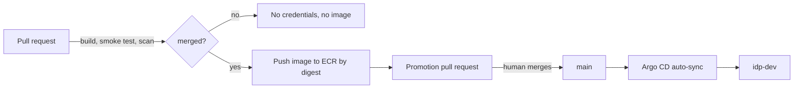

# Phase 3 implementation plan and runbook

Phase 2 made the AWS environment applyable. Phase 3 closes the delivery path: a
merge produces a scanned image in ECR, a reviewable Git change moves that exact
image into the cluster, and reverting the change moves it back.

## What was built

1. **Publishing identity** — `bootstrap/ecr-publish.tf` adds an
   `idp-ci-image-publish` role trusted only from `refs/heads/main`. It can obtain
   a registry token and push layers to `idp-*` repositories, and nothing else.
   Pull requests build and scan the identical image but cannot publish it.
2. **Digest-addressed deployments** — the chart gained `image.digest`, which wins
   over `image.tag` when set. A tag says which build; a digest says which bytes.
3. **Deployment state** — [`gitops/environments/dev/sample-service.yaml`](../gitops/environments/dev/sample-service.yaml)
   holds the image identity, separately from the chart that describes how it runs.
4. **Promotion** — `platform/scripts/promote-image.sh` rewrites that file, and the
   `promote` job in CI opens a pull request containing the rewrite.
5. **Argo CD** — a pinned installation under `platform/argocd/install`, an
   app-of-apps root, and a two-source Application with automated sync, self-heal
   and prune.

## The delivery path



Two human decisions gate a deployment: merging the code, and merging the
promotion. Neither the build nor Argo CD can skip the second one, because the
only thing Argo CD reads is the file the promotion pull request changes.

## Why a digest rather than a tag

ECR already enforces immutable tags, so a tag would be safe here. The digest is
used anyway for three reasons: it survives a move to a registry without
immutability, it is the identifier the Grype scan actually covered, and it makes
`kubectl describe pod` name the same bytes as the promotion commit. The tag is
still written for humans and still populates `APP_VERSION`.

## Runbook

Steps 1-2 are one-time. Step 3 onwards is the repeating delivery loop.

### 1. Grant CI permission to publish

Re-apply bootstrap to create the publishing role, then record its ARN:

```bash
cd infrastructure/terraform/environments/bootstrap
terraform apply
gh secret set AWS_IMAGE_PUBLISH_ROLE_ARN --body "$(terraform output -raw image_publish_role_arn)"
```

The `promote` job opens a pull request with the built-in `GITHUB_TOKEN`, so
enable **Settings > Actions > General > Allow GitHub Actions to create and
approve pull requests**. Leave the "approve" half unused: the promotion pull
request is reviewed by a person, and branch protection on `main` should require
that review.

### 2. Install Argo CD and register the applications

```bash
aws eks update-kubeconfig --region eu-west-2 --name idp-dev
kubectl kustomize platform/argocd/install | kubectl apply -f -
kubectl -n argocd rollout status deploy/argocd-server --timeout=300s

kubectl apply -f platform/kubernetes/namespace.yaml
kubectl apply -f platform/argocd/projects/
kubectl apply -f platform/argocd/applications/root.yaml
```

Replace `OWNER` in `platform/argocd/projects/` and under
`platform/argocd/applications/` with the GitHub account first; the AppProject
restricts sources to that exact repository URL.

The AppProject and the root Application are applied by hand on purpose. The root
manages every other Application, but something has to introduce the root, and a
project that Argo CD manages could be pruned into a state where it can no longer
manage anything.

Reach the UI and read the initial password:

```bash
kubectl -n argocd port-forward svc/argocd-server 8080:443
kubectl -n argocd get secret argocd-initial-admin-secret \
  -o jsonpath='{.data.password}' | base64 -d
```

Change that password and delete the secret before the cluster is shared. The
server is not exposed publicly; port-forwarding avoids paying for a load
balancer and avoids publishing an admin interface during development.

Nodes are private and pull from ECR through the NAT gateway. The node role
carries `AmazonEC2ContainerRegistryPullOnly`, so no image pull secret is needed
for repositories in this account.

### 3. Ship a change

1. Open a pull request. CI tests, builds, smoke tests and scans the image.
2. Merge it. The `container` job publishes the scanned image to ECR and records
   its digest; the `promote` job opens **Promote sample-service `<sha>` to dev**.
3. Review that pull request — it should contain exactly one changed file — and
   merge it.
4. Argo CD syncs within its polling interval, or immediately with
   `argocd app sync sample-service-dev`.

```bash
kubectl -n idp-dev get pods -o jsonpath='{.items[*].spec.containers[*].image}'
```

The printed reference must contain the digest from the promotion commit.

### 4. Roll back

```bash
git revert <promotion merge commit>
```

Merging the revert restores the previous digest and Argo CD syncs it back. The
image is still in the registry: tags are immutable and retention keeps twenty
tagged images per repository. `argocd app rollback` also works, but it moves the
cluster away from Git and the next reconciliation will undo it, so the revert is
the real mechanism.

### 5. Verify against the acceptance criteria

| Criterion | Check |
| --- | --- |
| Merge builds and scans an image | The `container` job summary names a pushed digest |
| An approved Git change deploys it | Merging the promotion pull request produces a Synced/Healthy Application running that digest |
| Reverting the change rolls it back | After `git revert`, pods run the previous digest without operator action |

Self-heal is demonstrated separately: `kubectl -n idp-dev scale deploy/sample-service --replicas=5`
should be reverted by the controller, because the cluster is not the source of
truth.

## Deliberately out of scope

The GitOps directory is not a separate repository; the reasoning and the cost of
splitting it are in [`gitops/README.md`](../gitops/README.md). There is no
staging environment and no promotion between environments — that is Phase 7. Argo
CD runs its non-HA manifests with the default admin account and no SSO, so it is
not exposed outside the cluster. Image signing and provenance attestation are not
implemented; the digest proves which bytes were scanned, not who built them. The
base image is still resolved by tag at build time, so builds are repeatable but
not bit-for-bit reproducible.
