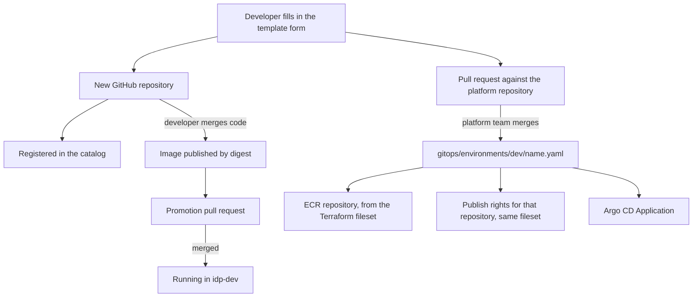

# Phase 4 implementation plan and runbook

Phase 3 closed the delivery path for a service that already exists. Phase 4 makes
creating that service self-service: a developer fills in a form and receives a
repository, a catalog entry, an owner, and everything the platform needs to deploy
it — without opening Terraform, Helm or Argo CD.

## What was built

1. **A shared chart.** `platform/helm/sample-service` became
   `platform/helm/service`, named from the release rather than the chart. One
   chart hard-named after one service cannot serve the services a template
   creates.
2. **Catalog and ownership** — `platform/backstage/catalog/`. Groups own things,
   people belong to groups. A service owned by a person becomes unowned the day
   they change team.
3. **The service template** — `platform/backstage/templates/node-service/`. Its
   skeleton is the repository a developer receives; its `platform-change`
   directory is the pull request the platform receives.
4. **The GitOps directory became the service registry.** Terraform derives both
   the ECR repositories and the image-publishing trust subjects from the files in
   `gitops/environments/dev`, so onboarding is one reviewed pull request rather
   than three edits the scaffolder cannot make.
5. **`platform/scripts/check-platform.py`** — checks in CI what Backstage would
   otherwise report at runtime in a portal nobody has opened.

## What a developer does, and what happens



The form collects five things: name, description, owner, system and lifecycle.
Everything else is derived. The repository is always named after the service,
because the ECR repository and the OIDC trust subject are derived from that name;
letting them differ would mean three names for one thing.

## Why onboarding is a pull request

The template could push directly to the platform repository — it has a token that
can. It opens a pull request instead, because merging that file is what grants the
new repository permission to publish images into the platform's registry. A
template that could grant itself AWS access would move the trust boundary from
"the platform team reviews infrastructure changes" to "the portal is trusted".

The same reasoning is why `gitops/**` and `infrastructure/**` are in
[`CODEOWNERS`](../.github/CODEOWNERS): a one-line file addition there is an
infrastructure change wearing a disguise.

## Why the registry is derived from a directory

A service exists on this platform exactly when it has deployment state. Terraform
enumerates `gitops/environments/dev/*.yaml` in two roots:

- `environments/dev` creates one ECR repository per registered service.
- `environments/bootstrap` trusts `repo:OWNER/<service>:ref:refs/heads/main` to
  publish into it.

The alternative — a list in a variable — cannot be edited by a scaffolder, which
would make onboarding a manual step and defeat the phase.

The risk this creates is real and worth stating: a file name in that directory
grants publish rights to a GitHub repository of the same name. Services built
inside the platform repository are therefore excluded through
`platform_owned_services`, so no separate repository called `sample-service` can
be created to claim its credentials. Review of that directory is the control.

## Runbook

### 1. Replace the placeholders

`OWNER` appears in the catalog files, `app-config.yaml`, the template and the Argo
CD manifests. `@OWNER` appears in `CODEOWNERS`. Replace both with the GitHub
account or team before starting the portal.

### 2. Start the portal

Follow [`platform/backstage/README.md`](../platform/backstage/README.md). It
covers generating the app, the plugins this configuration expects, the environment
variables it reads, and what has to change before anyone else uses it.

### 3. Create a service

In the portal, choose **Node.js HTTP service**, fill in the form and create. The
result page links to three things: the new repository, the platform pull request,
and the catalog entry.

### 4. Merge the platform pull request

It should contain exactly two files:

```
gitops/environments/dev/<name>.yaml            deployment state, not yet promoted
platform/argocd/applications/<name>-dev.yaml   how Argo CD deploys it
```

Check that the file name matches the repository that was created, then merge.
Apply Terraform to create the ECR repository and extend the publishing trust:

```bash
terraform -chdir=infrastructure/terraform/environments/bootstrap apply
terraform -chdir=infrastructure/terraform/environments/dev apply
terraform -chdir=infrastructure/terraform/environments/dev output registered_services
```

### 5. Configure the new repository

The scaffolded pipeline tests and scans with no configuration at all. Publishing
and promotion need three settings on the new repository:

```bash
gh variable set AWS_REGION --repo OWNER/<name> --body eu-west-2
gh secret set AWS_IMAGE_PUBLISH_ROLE_ARN --repo OWNER/<name> --body "$(...)"
gh secret set PLATFORM_REPO_TOKEN --repo OWNER/<name> --body "$(...)"
```

`PLATFORM_REPO_TOKEN` needs write access to the platform repository only, so that
the service's pipeline can open its promotion pull request. Without it the
pipeline still publishes and prints the exact command to promote by hand — it does
not fail. A GitHub App installation token scoped to the platform repository is the
right shape for this; a personal token works for a trial.

### 6. Verify against the acceptance criteria

| Criterion | Check |
| --- | --- |
| A developer creates a service through the portal | The template completes and links to a repository containing the skeleton |
| They receive a working repository | Its CI run is green: tests, container smoke test and image scan all pass |
| They receive a deployment | After merging the platform pull request and a promotion, the Application is Synced/Healthy and the pod runs the promoted digest |

```bash
kubectl -n idp-dev get pods -l app.kubernetes.io/name=<name> \
  -o jsonpath='{.items[*].spec.containers[*].image}'
```

## Deliberately out of scope

The Backstage app is not hosted in the cluster: it needs Postgres and secrets, and
secrets arrive with External Secrets in Phase 6. Identity is a placeholder user in
`org.yaml` rather than GitHub organisation ingestion, and the permission framework
is off because enforcing rules against a placeholder proves nothing. There is one
template; a second language would show whether the skeleton boundary is in the
right place, and there is no evidence for that yet. TechDocs is not configured, so
entity pages link to Markdown in GitHub rather than rendering it. Scaffolded
repositories are not added to the platform's Dependabot configuration, because
they carry their own.
