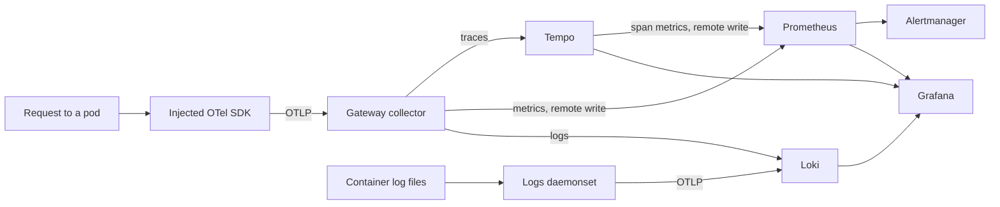

# Phase 5 implementation plan and runbook

Phases 1-4 built a path from a form to a running pod. Phase 5 makes what happens
after that visible: a request produces a trace, a service's metrics and logs are
findable from its name, and something that breaks raises an alert that says what
to do about it.

## What was built

1. **The signals backend** — Prometheus, Alertmanager and Grafana from
   `kube-prometheus-stack`; Tempo for traces; Loki for logs. All four are pinned
   Argo CD Applications in a new `platform` AppProject.
2. **A collector, twice** — a gateway collector every service sends OTLP to, and
   a daemonset that reads container logs off each node. One technology carries
   all three signals, so there is no second agent with its own config language.
3. **Auto-instrumentation** — an `Instrumentation` resource plus a pod annotation
   in the shared chart. Services get traces without a dependency, a code change,
   or the chance to forget.
4. **Dashboards and alerts as files** — a Grafana dashboard in a ConfigMap and a
   `PrometheusRule`, both reviewed like anything else.
5. **Checks** — `check-platform.py` grew rules for Argo CD projects, chart
   version pinning, dashboard JSON and alert annotations.

## How a signal gets from a request to a screen



The service knows one endpoint. Where the data actually lands is a platform
decision that can change without touching a single service.

## Decisions worth explaining

**Auto-instrumentation rather than an SDK dependency.** The sample service has no
dependencies and the skeleton does not add any. The operator injects the SDK at
admission instead, which means no team can drift onto an old SDK, and the
container image is unchanged. The cost is real: auto-instrumentation produces
spans for inbound and outbound HTTP and nothing else. A span around a business
decision still has to be written by hand, and the SDK version is now the
platform's problem rather than each team's.

**Metrics are pushed, not scraped.** The collector remote-writes to Prometheus.
Scraping would mean a `ServiceMonitor` matching port names the operator
generates, and keeping the two in step forever. Remote write is one endpoint that
either works or fails loudly — and the failure has an alert on it.

**A second AppProject.** The observability charts need custom resource
definitions, cluster roles and admission webhooks. Granting that to the `idp`
project — the one that deploys application code — would mean a compromised
service chart could rewrite cluster-wide permissions. `platform` has those
rights; `idp` still cannot create a single cluster-scoped object.

**The control plane is not scraped.** On EKS, etcd, the scheduler, the controller
manager and kube-proxy are managed and unreachable. Their scrape jobs and default
alert rules are turned off, because permanently-failing targets are how teams
learn to ignore alerts.

**Nothing is durable.** Prometheus, Loki and Tempo all write to `emptyDir` with
24-hour retention. Data does not survive a pod restart. That is the right trade
for a cluster torn down between sessions and the wrong one for anything else; the
change is a PVC on the gp3 StorageClass that Phase 2 already installed.

## Capacity

The stack requests roughly 850m CPU and 2 GiB of memory on top of the platform's
existing workloads. Two `t3.medium` workers provide about 3.5 allocatable vCPU
and 6 GiB, so it fits — with little room for a spot reclaim to land badly. For a
demonstration, raise the node group first:

```bash
terraform -chdir=infrastructure/terraform/environments/dev apply \
  -var 'desired_size=3' -var 'min_size=3'
```

Nothing here adds a load balancer or a volume, so the observability stack costs
no AWS charge of its own. A third node does — roughly $10/month on spot.

## Runbook

### 1. Create the Grafana credential

Grafana's password is not in Git and not in a values file. Create it before the
first sync, or the Grafana pod will not start:

```bash
kubectl create namespace observability --dry-run=client -o yaml | kubectl apply -f -
kubectl -n observability create secret generic grafana-admin \
  --from-literal=admin-user=admin \
  --from-literal=admin-password="$(openssl rand -base64 24)"
```

Read it back when you need it:

```bash
kubectl -n observability get secret grafana-admin \
  -o jsonpath='{.data.admin-password}' | base64 -d
```

### 2. Register the project and let Argo CD do the rest

```bash
kubectl apply -f platform/argocd/projects/
```

The app-of-apps picks up the five new Applications on its next reconciliation.
They are ordered by sync wave: the four charts install first, and the
configuration that depends on their custom resources follows.

```bash
kubectl -n argocd get applications
kubectl -n observability get pods -w
```

Replace `OWNER` in the new Applications and the alert rules first, as in every
previous phase.

### 3. Redeploy a service so it is instrumented

The annotation that triggers injection comes from the shared chart, so a service
picks it up the next time its Application syncs. Auto-instrumentation is applied
at admission, which means an existing pod is not instrumented — it has to be
recreated:

```bash
kubectl -n idp-dev rollout restart deployment/sample-service
kubectl -n idp-dev get pod -l app.kubernetes.io/name=sample-service \
  -o jsonpath='{.items[0].spec.initContainers[*].name}'
```

An `opentelemetry-auto-instrumentation-nodejs` init container means the injection
happened. If it is absent, the operator's webhook did not see the pod: check that
the `Instrumentation` resource exists and that the annotation names it as
`observability/nodejs`.

### 4. Produce a trace

```bash
kubectl -n idp-dev port-forward svc/sample-service 8080:80 &
for i in $(seq 1 20); do curl -s http://127.0.0.1:8080/ > /dev/null; done
curl -s -o /dev/null -w '%{http_code}\n' http://127.0.0.1:8080/missing
```

Then in Grafana (`kubectl -n observability port-forward svc/kube-prometheus-stack-grafana 3000:80`):

- **Explore → Tempo → Search** for `service.name = sample-service`. A trace should
  show a `GET /` server span.
- Open the trace and follow **Logs for this span** into Loki.
- **Dashboards → IDP / Service overview** shows request rate, error rate and
  latency percentiles once the metrics generator has seen a minute of traffic.

### 5. Demonstrate an alert

`ServiceNoReplicasAvailable` is the quickest to show honestly, because it breaks
something real rather than editing a threshold:

```bash
kubectl -n idp-dev scale deployment/sample-service --replicas=0
```

Argo CD self-heal will put it back within a minute or two, so to hold the state
long enough for the two-minute `for:` clause, disable auto-sync on the Application
first in the UI, or use a bad image instead:

```bash
kubectl -n idp-dev set image deployment/sample-service api=example.invalid/nope:1
```

Watch it fire:

```bash
kubectl -n observability port-forward svc/kps-alertmanager 9093:9093
# then open http://localhost:9093
```

Undo it by letting Argo CD sync, or `kubectl -n idp-dev rollout undo deployment/sample-service`.

## Responding to alerts

Every alert links here. Each entry says what the alert means and what to look at
first — an alert that fires without saying what to do about it is a notification.

| Alert | What it means | First thing to check |
| --- | --- | --- |
| `ServiceNoReplicasAvailable` | Nothing is serving. Users see errors now | `kubectl -n idp-dev describe deployment/<name>`, then the pod events. An image that cannot be pulled and a probe that never passes look the same from outside |
| `ServiceDeploymentUnavailable` | Running degraded for ten minutes | Whether a spot reclaim took a node and the replacement is pending, or whether the new pod is failing to start |
| `ServicePodRestartLoop` | Something crashes or fails liveness repeatedly | The logs panel filtered to that pod. A crash on startup and a liveness timeout under load are different problems with the same symptom |
| `ServiceHighErrorRate` | More than 5% of requests failed, measured from server spans | The trace search filtered to error status. The failing span names say which route |
| `ServiceLatencyHigh` | p95 above one second for ten minutes | The latency panel: if p50 moved too it is the whole service, if only p95 moved it is a subset of requests |
| `TelemetryExportFailing` | Telemetry is being dropped between the collector and its backends | The collector's logs. Dashboards will look fine and be wrong until this is fixed |
| `TelemetryCollectorRefusingData` | The memory limiter is shedding load | Whether the collector is undersized or something is sending far more than usual |

## Verify against the acceptance criteria

| Criterion | Check |
| --- | --- |
| A sample request produces a trace | Step 4: a `GET /` span for `sample-service` in Tempo |
| Service metrics are discoverable | The dashboard shows request rate and latency for the service by name |
| Service logs are discoverable | Loki returns lines for `{k8s_namespace_name="idp-dev"}`, and a span links to them |
| An alert is demonstrated | Step 5: the alert appears in Alertmanager and clears when the cause is undone |

## Deliberately out of scope

No durable storage, so nothing survives a pod restart. No Alertmanager receiver:
alerts are demonstrated in its UI rather than wired to a channel nobody reads,
because a route to an unread inbox looks like coverage and is not. No SLOs or
error budgets — they need a stated objective and history to measure against, and
Phase 7 is where that belongs. No log-based alerting, no exemplars linking
metrics to traces, and no profiling. The portal's Grafana and Argo CD panels are
still reached by port-forward, since nothing here is exposed publicly.
