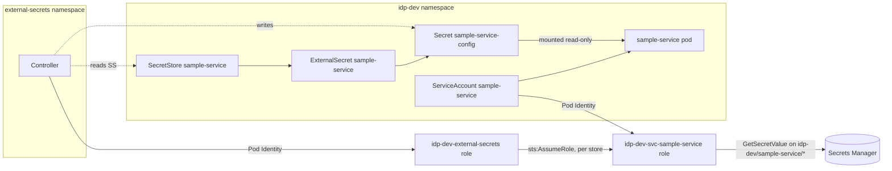

# Phase 6 implementation plan and runbook

Phases 1-5 made delivery work and made it visible. Phase 6 constrains it: each
service gets AWS access to its own secrets and nothing else, those secrets reach
the workload and follow rotation without a redeploy, and a manifest that breaks
the platform's conventions is refused by the API server rather than discovered in
production.

## What was built

1. **Per-service AWS identity** — `environments/dev/workload-identity.tf` gives
   every registered service an IAM role, bound to its Kubernetes service account
   through EKS Pod Identity, that can read `idp-dev/<service>/*` in Secrets
   Manager. Roles, secrets and bindings are derived from `gitops/` like the ECR
   repositories, so onboarding a service still takes one pull request.
2. **External Secrets** — a controller that holds no secret permission of its
   own. Each service's SecretStore names that service's role, and the controller
   assumes it per store. Cluster-wide stores are not merely forbidden: their CRDs
   are not installed.
3. **Secrets as files** — the shared chart mounts each service's secret read-only
   at `/var/run/secrets/app`, where a rotation lands in place.
4. **Kyverno admission policy** — six policies scoped to `idp-dev`: digest-pinned
   images from the platform registry, pod security, resource bounds, a dedicated
   service account, and two that stop one service reaching another's secrets
   through a namespace they share.
5. **Scoped human access** — an optional developer role with read-only access to
   `idp-dev` through an EKS access entry. It sees workloads and logs; it cannot
   read Secrets or change anything outside a pull request.
6. **Tests with teeth** — `test-policies.sh` renders the real chart and runs every
   policy against it, against sixteen deliberate violations, and against
   platform components in another namespace that every policy must skip — 67 tests
   in CI, plus a scope check that every expectation was genuinely evaluated.

## The access model



Three independent boundaries stand between one service and another's secrets:

| Layer | What it stops | Where it lives |
| --- | --- | --- |
| IAM | A service role reading another prefix; the controller reading anything directly | `workload-identity.tf` |
| Admission | A store naming another service's role; a secret wired to another's store or key; a pod mounting another's Secret | `platform/security/policies` |
| Git review | A workload claiming another service's name in the first place | Argo CD Applications, `CODEOWNERS` |

Admission policy checks that a resource's wiring is consistent with its
`app.kubernetes.io/name` label. It cannot prove the label is honest. That
guarantee comes from the third row: workloads reach the cluster only through
reviewed Applications whose names match a registered service.

## Decisions worth explaining

**`ValidatingPolicy`, not `ClusterPolicy`.** Kyverno 1.19 still serves
`ClusterPolicy` but marks it deprecated. New policies are written against
`policies.kyverno.io/v1` with CEL expressions — the same language as Kubernetes'
own ValidatingAdmissionPolicy, so the rules are portable beyond Kyverno.

**The controller holds no secret permission.** A single External Secrets role
that can read every secret is the usual setup and the wrong one here: any store
in any namespace could use it, and CloudTrail would show one identity reading
everything. Instead the controller can only assume `idp-dev-svc-*` roles, and each
read appears under the service's own role name.

**Pod Identity trust is pinned to the service account.** Each role's trust policy
requires the `kubernetes-namespace` and `kubernetes-service-account` session tags
Pod Identity presents. An association binding the role to any other account —
created by mistake or otherwise — cannot obtain credentials. Pod Identity's tags
are transitive, so the role also grants `sts:TagSession` to the controller, or the
chain is refused.

**Terraform owns that a secret exists, never its value.** A secret version in
Terraform would put the value in state, and a later apply could silently roll a
rotated secret back to whatever Terraform last wrote. The value is set out of band
and rotated the same way.

**Files, not environment variables.** A mounted Secret is updated in place when it
changes. An environment variable is fixed for the life of the process, so a
rotation would need a restart nobody remembers to trigger.

**Init containers — corrected in Phase 7.** This phase originally excluded init
containers from pod-security policy, on the belief that the OpenTelemetry Operator
injects one with no security context. That was wrong: the operator (v0.158.0) copies
the first application container's context onto it. Phase 7 makes that explicit with
`initContainerSecurityContext` on the Instrumentation and now checks init containers
in pod-security policy as well. The image policy still excludes them, because the
operator references its instrumentation image by tag from its own registry.
Secret-access checks always included init containers.

**CPU limits are not required.** Requests and a memory limit are. A CPU limit
throttles a service that has idle CPU next to it, which surfaces as unexplained
latency — harder to diagnose than the problem it prevents.

**Policy fails closed, but not everywhere.** Kyverno's webhook never receives
requests for `kube-system`, `kyverno`, `argocd`, `external-secrets` or
`observability`. If Kyverno is down and refusing admission, the tools needed to
repair it keep working. Every policy also carries its own namespace selector, and
CI rejects one that does not.

**The test suite checks its own coverage.** Building it surfaced two ways a green
run could prove nothing. The Kyverno CLI reads namespace labels only from a
`variables` file, not from Namespace objects; without one, every namespace
selector is ignored and every policy evaluates every namespace. And the CLI grades
a resource its policy excluded as passing whatever result was declared, so a
policy whose selector matched nothing — a typo such as `idp-devv` — would exclude
every fixture and pass the entire suite. Negative controls confirmed both. The
fixes are structural rather than remembered: `check-platform.py` refuses a test
without namespace labels or without a pass, fail *and* skip result for every
policy, and `test-policies.sh` fails when any expected pass or fail was excluded
instead of evaluated. With those in place, weakening a rule, mis-scoping a policy,
moving a violation out of scope, or a chart change that breaks policy each fail CI.

## Cost

Secrets Manager charges $0.40 per secret per month, plus $0.05 per 10,000 API
calls. External Secrets re-reads each secret on its refresh interval: at the
one-minute interval used here that is about 43,000 calls, or $0.22, per service
per month. The interval is one minute so a rotation is demonstrable in a
sitting; an hour is the sensible production value and makes the call cost
negligible.

## Runbook

### 1. Apply the identity layer

Replace `AWS_ACCOUNT_ID` in `platform/helm/service/values-dev.yaml` with the
account ID, quoted. The chart refuses to render an unquoted one, because YAML
would read it as a number and print it in scientific notation inside a role ARN.

```bash
terraform -chdir=infrastructure/terraform/environments/dev apply
terraform -chdir=infrastructure/terraform/environments/dev output service_role_arns
```

To grant developers read-only cluster access, pass an existing role:

```bash
terraform -chdir=infrastructure/terraform/environments/dev apply \
  -var 'developer_role_arn=arn:aws:iam::111122223333:role/developers'
```

### 2. Let Argo CD install the security layer

```bash
kubectl apply -f platform/argocd/projects/
kubectl -n argocd get applications -w
```

Sync waves order it: Kyverno and External Secrets (-2), then the policies (-1),
then services (0). Services never exist in the cluster without policy in front of
them.

### 3. Put a value in a service's secret

Terraform created the secret empty. Until it has a value, the service still
starts — the volume is optional — and External Secrets reports that it cannot
read it.

```bash
aws secretsmanager put-secret-value \
  --secret-id idp-dev/sample-service/config \
  --secret-string '{"greeting":"hello"}'

kubectl -n idp-dev get externalsecret sample-service       # READY True
kubectl -n idp-dev exec deploy/sample-service -- cat /var/run/secrets/app/greeting
```

Each top-level JSON key becomes one file.

### 4. Rotate it and watch it arrive

```bash
aws secretsmanager put-secret-value \
  --secret-id idp-dev/sample-service/config \
  --secret-string '{"greeting":"rotated"}'

watch -n 10 kubectl -n idp-dev exec deploy/sample-service -- cat /var/run/secrets/app/greeting
```

The new value appears within the refresh interval plus the kubelet's own sync,
normally under two minutes, with no restart:

```bash
kubectl -n idp-dev get pods -l app.kubernetes.io/name=sample-service   # RESTARTS unchanged
```

### 5. Show that an invalid manifest is rejected

The test fixtures double as the demonstration:

```bash
kubectl apply -f platform/security/tests/violations/pods.yaml
```

Every document is refused, each with the message of the rule it broke. The same
rejection appears as a sync error on the Application in Argo CD when a chart
change produces a non-compliant Deployment — before any pod is created.

### 6. Show that access is scoped

Ask IAM directly rather than trusting the policy text:

```bash
role=$(terraform -chdir=infrastructure/terraform/environments/dev output -json service_role_arns | jq -r '."sample-service"')
account=$(aws sts get-caller-identity --query Account --output text)
aws iam simulate-principal-policy --policy-source-arn "$role" \
  --action-names secretsmanager:GetSecretValue \
  --resource-arns \
    "arn:aws:secretsmanager:eu-west-2:${account}:secret:idp-dev/sample-service/config-AbCdEf" \
    "arn:aws:secretsmanager:eu-west-2:${account}:secret:idp-dev/payments/config-AbCdEf" \
  --query 'EvaluationResults[].[EvalResourceName,EvalDecision]' --output table
```

The first resource is `allowed`, the second `implicitDeny`. Reads by External
Secrets appear in CloudTrail under `idp-dev-svc-sample-service`, not under a shared
controller identity.

For the developer role:

```bash
aws eks update-kubeconfig --name idp-dev --role-arn arn:aws:iam::111122223333:role/developers
kubectl auth can-i get pods -n idp-dev          # yes
kubectl auth can-i get secrets -n idp-dev       # no
kubectl auth can-i create deployments -n idp-dev  # no
kubectl auth can-i get pods -n kube-system      # no
```

## Verify against the acceptance criteria

| Criterion | Check |
| --- | --- |
| Secret rotation reaches a workload | Step 4: the mounted file changes after `put-secret-value`, with no pod restart |
| Invalid manifests are rejected | Step 5: every violation fixture is refused with its policy's message |
| Workloads have scoped AWS access | Step 6: IAM allows the service's own prefix and denies a neighbour's |

## Deliberately out of scope

**There are no NetworkPolicies.** Every pod in `idp-dev` can reach every other pod
and anything the NAT gateway can reach. Secrets are isolated between services;
network traffic is not. A default-deny policy per namespace, with explicit allows
per service, is the most important gap this phase leaves.

**Images are not signature-verified.** Policy requires a digest from the platform
registry, which proves the bytes are ones CI pushed, not who built them. Signing
in CI and an `ImageValidatingPolicy` checking it is the natural next step now that
every deployment is already digest-addressed.

Rotation is manual: there is no Secrets Manager rotation Lambda. Argo CD still has
a single admin account and no SSO, Backstage permissions remain off, and policy
reports are not alerted on. The External Secrets controller exports metrics that
are not yet scraped, because security installs before the monitoring CRDs exist.
