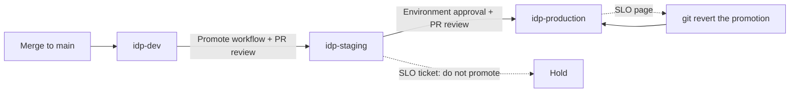

# Phase 7 implementation plan and runbook

Phases 1-6 built one environment that delivers, observes and constrains. Phase 7
turns that into a release path: a change is proven in staging before it may run in
production, production is sized to survive the disruptions a spot cluster produces,
reliability is measured against stated objectives, and a bad release can be
recovered by a procedure that is tested on every change.

## What was built

1. **Three environments** — `idp-dev`, `idp-staging` and `idp-production`, each a
   namespace with its own deployment state, Argo CD Application, chart values, IAM
   roles and secrets. Terraform derives all of it from `gitops/environments/<env>`.
2. **Promotion by digest** — `promote-environment.sh` copies the exact image a
   service runs in one environment into the next, and only the next. The `Promote`
   workflow runs it inside a GitHub Environment and opens a pull request.
3. **"Passed staging" enforced from history** — `check-platform.py` refuses any
   digest the previous environment never ran in an earlier commit of its own.
4. **Resilience in the chart** — HorizontalPodAutoscaler, PodDisruptionBudget and
   zone spread, with guards that refuse configurations that would hurt. metrics-server
   is installed, since EKS does not ship it.
5. **Service level objectives** — multi-window, multi-burn-rate alerts for
   availability, unit-tested with promtool.
6. **A tested recovery path** — `rollback-drill.sh` releases through every environment
   and recovers production, in CI.

Building this also found and fixed two defects from earlier phases, described under
[Defects found in earlier phases](#defects-found-in-earlier-phases).

## The release path



| Step | Gate | Enforced by |
| --- | --- | --- |
| Merge to dev | Code review; CI builds, scans and publishes | Branch protection, `ci.yaml` |
| dev to staging | Promotion pull request review | `promote.yaml`, `check-platform.py` |
| staging to production | GitHub Environment reviewer, then pull request review | `production` Environment, `check-platform.py` |
| Every promotion | The digest ran in the previous environment first | Git history, checked in CI |

## Decisions worth explaining

**Namespaces, not clusters.** A second and third EKS cluster would each add the
$73 control plane, a NAT gateway and nodes — roughly tripling the fixed cost of a
portfolio platform. Environments are namespaces in one cluster instead, separated
by Pod Security, Kyverno policy, per-environment IAM roles and per-environment
secrets. What that does not separate is the blast radius of the cluster itself: a
control-plane or node-group failure affects every environment at once. Moving
production to its own cluster is a Terraform root per environment and a new Argo CD
destination; nothing in the charts, policies or promotion flow assumes one cluster.

**Promotion copies, it never rebuilds.** The repository, tag and digest are copied
verbatim from the previous environment's file. A rebuild of the same commit is not
the same bytes — base images move — and would mean production ran something staging
never did.

**"Passed staging" is a fact about a digest, checked from Git.** The Promote workflow
only offers adjacent promotions, but a person can edit a file by hand. So the
validator walks history: a production digest must appear in a staging commit that
did not also change production. A hand edit fails, and so does a single pull request
that moves staging and production together, because nothing ran in staging first.
This needs full history, so CI checks out with `fetch-depth: 0`, and the check
refuses to run on a shallow clone rather than silently passing.

**Two approvals for production, in different places.** The `production` GitHub
Environment requires a reviewer before the workflow can obtain a token, and the
promotion still arrives as a pull request. The first decides *whether* to promote;
the second reviews *what* is being promoted.

**The autoscaler owns replicas.** With autoscaling enabled the chart omits
`spec.replicas`. Rendering it as well would make Argo CD reset the count on every
reconciliation, undoing each scaling decision minutes after it was made.

**Guards instead of warnings.** The chart refuses an autoscaler that could reach one
replica, and refuses a disruption budget on a single replica — which would not
protect it, but would make every node drain hang. `unhealthyPodEvictionPolicy:
AlwaysAllow` stops an already crash-looping pod from blocking a drain as well.

**Burn rate, not error rate.** A threshold on error rate pages for a two-minute blip
and sleeps through a slow leak that spends the month's budget by Thursday. Burn-rate
alerts ask when the budget runs out at the current pace, pairing a long window that
proves the problem is real with a short one that proves it is still happening. Pages
also require at least one request a minute, because one failed health check on an
idle service is a 50% error rate. Staging burns raise tickets, never pages — staging
failing is the system doing its job. Dev has no objective.

## Defects found in earlier phases

**Tempo was never generating span metrics.** Phase 5 enabled Tempo's metrics
generator but not its processors, which Tempo requires per tenant in `overrides`.
The generator would have run and produced nothing, leaving every latency and error
alert, the service dashboard and these SLOs permanently inert — and silently so,
because an absent series does not fire anything. The processors are now enabled, and
span metrics carry `k8s.namespace.name` so environments sharing a cluster do not
blend into one error budget.

**The injected init container was misdescribed.** Phase 6 treated the OpenTelemetry
Operator's init container as having no security context and excluded init containers
from pod-security policy. The operator's source (v0.158.0) shows it inherits the first
application container's context. The namespaces enforce the restricted Pod Security
Standard, so relying on "whichever container is first" was fragile. The platform's
Instrumentation now sets `initContainerSecurityContext` explicitly, and pod-security
policy checks init containers too.

## Capacity and cost

Production runs three replicas at its floor and staging two, beside dev's two, plus
metrics-server's two. With the Phase 5 observability stack this exceeds what two
`t3.medium` workers schedule comfortably, so run three workers:

```bash
terraform -chdir=infrastructure/terraform/environments/dev apply -var 'desired_size=3' -var 'min_size=3'
```

A third spot worker adds roughly $10 a month. Secrets Manager adds $0.40 per secret
per month for each service in each environment. Namespaces, autoscalers, budgets and
alert rules cost nothing of their own.

## Runbook

### 1. Create the GitHub Environments

```bash
repo="$(gh repo view --json nameWithOwner -q .nameWithOwner)"
gh api --method PUT "repos/${repo}/environments/staging"
gh api --method PUT "repos/${repo}/environments/production" --input - <<'JSON'
{
  "reviewers": [{ "type": "Team", "id": 0 }],
  "deployment_branch_policy": { "protected_branches": true, "custom_branch_policies": false }
}
JSON
```

Replace `0` with the platform team's ID (`gh api orgs/ORG/teams/TEAM -q .id`). The
branch policy means only runs from protected `main` can deploy to production.

### 2. Apply the environments

```bash
kubectl apply -f platform/kubernetes/namespace.yaml
kubectl apply -f platform/argocd/projects/
terraform -chdir=infrastructure/terraform/environments/dev apply
terraform -chdir=infrastructure/terraform/environments/dev output environment_services
```

Replace `AWS_ACCOUNT_ID` in `values-staging.yaml` and `values-production.yaml` as in
Phase 6, and put a value in each environment's secret:

```bash
for env in staging production; do
  aws secretsmanager put-secret-value --secret-id "idp-${env}/sample-service/config" --secret-string '{"greeting":"hello"}'
done
```

### 3. Promote a release

After a digest reaches dev through the Phase 3 path:

```bash
gh workflow run promote.yaml -f service=sample-service -f target=staging
gh run watch
gh pr list --search "Promote sample-service in:title"
```

Review and merge. Argo CD deploys it to `idp-staging`. Check it before going further:

```bash
kubectl -n idp-staging get hpa,pdb,pods -l app.kubernetes.io/name=sample-service
```

and confirm the service dashboard shows no staging SLO ticket. Then:

```bash
gh workflow run promote.yaml -f service=sample-service -f target=production
```

The run waits for a `production` reviewer before it starts, then opens a second pull
request. Merge it, and Argo CD deploys to `idp-production`.

## Recovering a release

Every SLO alert links here. Find the row that matches, and prefer the tested path.

| Situation | Action | Tested |
| --- | --- | --- |
| Production is failing after a release | Revert the promotion | **Yes**, `rollback-drill.sh` in CI |
| Staging is failing | Do not promote; revert the staging promotion or fix forward in dev | Same mechanism as above |
| Nothing can be admitted in any environment | Remove Kyverno's webhooks | No |
| A secret value is wrong | Move `AWSCURRENT` back to the previous version | No |
| The cluster is gone | Rebuild from Terraform; Argo CD restores from Git | No |
| Terraform state is damaged | Restore the previous object version from S3 | No |

### Production is failing after a release

```bash
git log --oneline -- gitops/environments/production/sample-service.yaml
git revert <promotion commit>
```

Open that as a pull request and merge it. The previous digest returns and Argo CD
syncs it; `argocd app sync sample-service-production` skips the polling wait. The
image still exists — tags are immutable and retention keeps twenty.

Two things that look like shortcuts and are not. `argocd app rollback` moves the
cluster away from Git, and self-heal moves it straight back. Promoting an older
digest forward also works only if staging ran it, and a revert is exact where picking
a digest by hand is not.

### Nothing can be admitted

If every pod creation in the workload namespaces fails with a webhook timeout,
Kyverno is down and failing closed. Platform namespaces are excluded from its
webhook, so the tools to fix it still run:

```bash
kubectl -n kyverno get pods
kubectl -n kyverno rollout restart deployment/kyverno-admission-controller
```

If it will not recover and an outage is in progress, removing the webhooks restores
admission — **without policy** — until Kyverno is healthy and recreates them:

```bash
kubectl delete validatingwebhookconfiguration,mutatingwebhookconfiguration -l webhook.kyverno.io/managed-by=kyverno
```

Treat that as an incident in its own right.

### A secret value is wrong

```bash
aws secretsmanager list-secret-version-ids --secret-id idp-production/sample-service/config
aws secretsmanager update-secret-version-stage --secret-id idp-production/sample-service/config \
  --version-stage AWSCURRENT --move-to-version-id <previous> --remove-from-version-id <current>
```

The file in the pod follows within the environment's refresh interval — an hour in
production. Restart the Deployment if it cannot wait, which re-reads immediately.

### The cluster is gone

Follow **Rebuilding** in the [teardown runbook](teardown.md). Every workload returns
from Git at the digests it last ran, in every environment. Secret values are the one
thing that does not: they are deliberately not in Terraform, so put them back.

### Terraform state is damaged

The state bucket is versioned. List the versions and restore the last good one:

```bash
aws s3api list-object-versions --bucket <state bucket> --prefix idp/dev/terraform.tfstate \
  --query 'Versions[].[VersionId,LastModified,Size]' --output table
aws s3api copy-object --bucket <state bucket> --key idp/dev/terraform.tfstate \
  --copy-source "<state bucket>/idp/dev/terraform.tfstate?versionId=<good version>"
terraform -chdir=infrastructure/terraform/environments/dev plan
```

A plan with no unexpected changes confirms the restored state matches reality.

## Verify against the acceptance criteria

| Criterion | Check |
| --- | --- |
| A release passes staging | The staging promotion merges, the Application is Healthy, and no staging SLO ticket is open |
| It reaches production | The production run waits for an Environment reviewer, the pull request merges, and pods run the staging digest |
| It can be recovered using a tested runbook | Reverting the production promotion restores the previous digest — the procedure `rollback-drill.sh` performs on every CI run |

## Deliberately out of scope

**No progressive delivery.** A production promotion replaces every pod in a rolling
update; there is no canary or automated analysis. Argo Rollouts, gated on the SLO
recording rules here, is the natural addition.

**No automated rollback.** An SLO page tells a person to revert; nothing reverts on
its own. That is deliberate until the alerts have a record of paging only when they
should.

**No separate production cluster, sync windows or change freezes.** Production shares
the cluster's control plane and node group with everything else. There is no latency
objective yet, only availability, and no second region.
